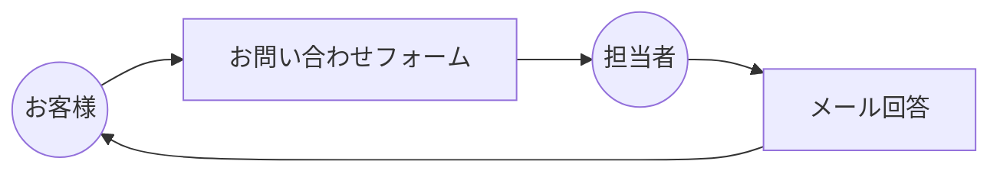
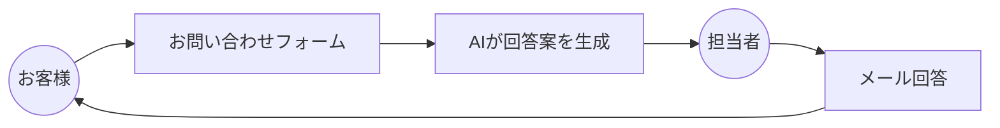
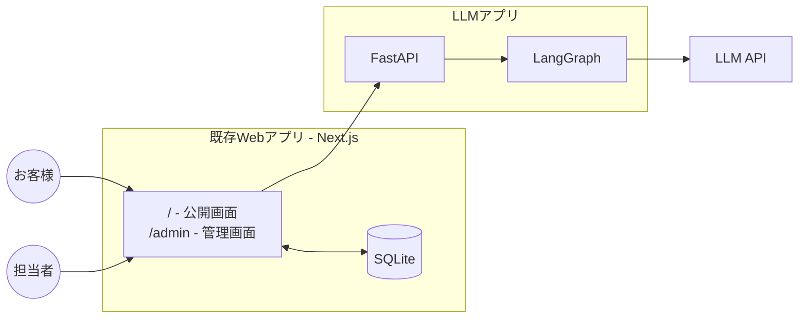
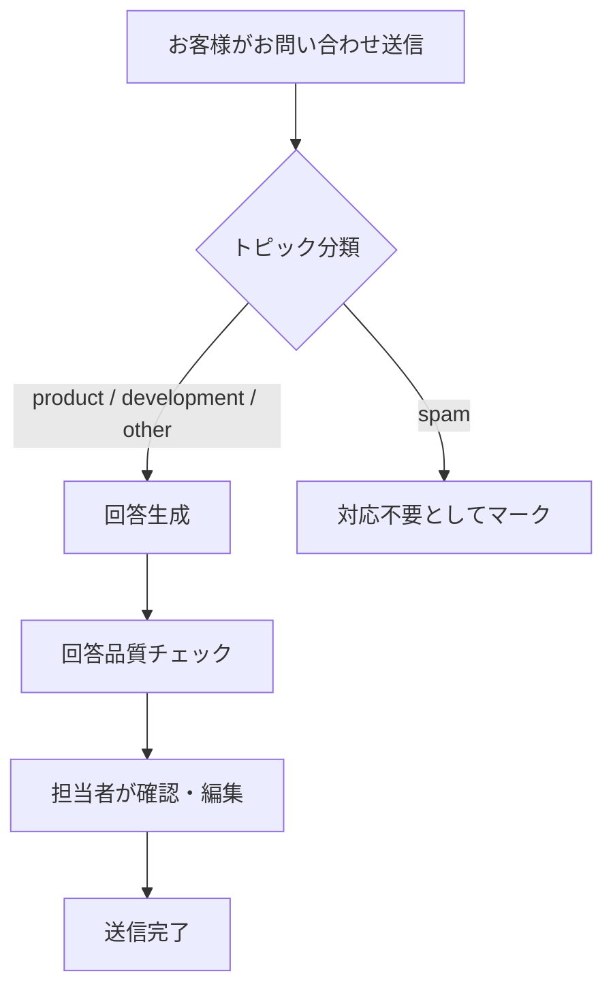
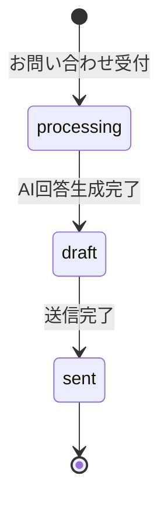

# お問い合わせ対応AIアシスタント - 仕様書

## 1. プロジェクト概要

### 1.1 背景

#### 想定する会社

本サンプルでは、以下の架空の会社を想定する。

- 会社名: 株式会社サンプルエージェント
- 事業内容:
  - AIエージェント開発支援（AIエージェントの受託開発）
  - AgentBoard の提供（法人向けChatGPT型サービス）

#### 課題

会社のWebサイトからお問い合わせがあった際、担当者が0からメール回答を作成するのではなく、AIが生成した回答案をもとに必要に応じて編集してメール送信することで、業務効率化を図る。

### 1.2 目的

- 担当者のメール作成時間の短縮
- 回答品質の均一化

### 1.3 スコープ

本プロジェクトでは以下を対象とする：

- 会社Webサイトのお問い合わせフォームからの問い合わせ
- メールによる回答（※本サンプルでは実際のメール送信は行わず、画面上で送信完了を表示）

### 1.4 お問い合わせの例

本システムで対応するお問い合わせの例を示す。

#### 例1: 開発支援に関する質問

```
社内のCRMと連携して営業活動を支援するAIエージェントの開発を検討しています。

カスタムエージェントの開発支援について、概算費用と期間を教えていただけますか。
```

#### 例2: AgentBoardに関する質問

```
青葉テクノロジー株式会社の佐藤と申します。
貴社のAgentBoardの導入を検討しており、トライアルでのサポート体制についてお伺いしたく、ご連絡いたしました。

弊社は従業員約100名のSaaS企業で、社内ナレッジの検索・回答業務にAgentBoardを活用できないか検討を進めております。
導入にあたっては社内稟議が必要なため、2週間程度のトライアル期間を設けて、実際の利用データを用いて精度や運用性を評価したいと考えております。

つきましては、トライアルが可能か、可能な場合にご支援いただける内容（導入支援・プロンプトチューニング相談など）、および社内稟議で参考にできる比較資料や導入事例集の有無について、お伺いできればと存じます。

よろしくお願いいたします。
```

#### 例3: その他（パートナー提携の打診）

```
株式会社サンプルエージェント 担当者様

山下システムズ株式会社の田中と申します。
貴社とのパートナー提携についてご相談させていただきたく、ご連絡いたしました。

弊社は製造業を中心にDX支援を行うITコンサルティング企業で、現在3社のクライアントからAIエージェントの導入相談を受けております。
各社の業務要件に最適なソリューションとして、貴社のAgentBoardをご紹介できないかと考えております。

つきましては、リファラル提携の条件や認定パートナー制度の有無などについて、お伺いできればと存じます。

お忙しいところ恐れ入りますが、何卒よろしくお願い申し上げます。
```

### 1.5 業務フロー（現状 → 目標）

**現状**


**目標**


## 2. システム構成

### 2.1 登場人物

| アクター | 説明 |
|---------|------|
| お客様 | 会社Webサイトからお問い合わせを送信する人 |
| 担当者 | AI回答を確認・編集し、返信を行う社内の人 |

### 2.2 全体アーキテクチャ



※ Next.jsの`after`機能により、お客様へのレスポンス後にFastAPIを呼び出し、結果をDBに保存

### 2.3 技術スタック

| レイヤー | 技術 |
|---------|------|
| 既存Webアプリ | Next.js (App Router), SQLite |
| LLMアプリ | FastAPI, LangChain/LangGraph |
| LLM | Anthropic Claude |
| LLMOps | LangSmith |

## 3. 機能要件

### 3.1 処理フロー



※回答品質チェックでは「丁寧な言葉遣い」を評価し、結果を管理画面に表示する

### 3.2 機能一覧

#### F-001: お問い合わせ受付

- Webフォームからのお問い合わせを受け付ける
- お問い合わせにIDを付与し、ステータスを「受付済み」に設定

#### F-002: トピック分類

- お問い合わせ内容を分析し、以下のカテゴリに分類：
  - `development`: AIエージェント開発支援サービスに関する質問
  - `product`: AgentBoardプロダクトに関する質問
  - `other`: その他の問い合わせ
  - `spam`: スパム・営業メール・不適切な問い合わせ

#### F-003: 回答メール生成

- トピックに応じた回答メール案を生成

#### F-004: 回答品質チェック

- 生成された回答の品質を以下の観点で評価：
  - 丁寧な言葉遣い：ビジネスメールとして適切な敬語・丁寧語が使われているか（OK/NG）

#### F-005: 担当者確認画面

- お問い合わせ内容の表示
- AI生成回答メール案の表示
- 品質指標の表示（分類の確信度、丁寧さチェック結果）
- 回答の編集機能
- 承認・送信機能

#### F-006: 送信完了処理

- 担当者が承認した回答を「送信済み」としてマーク
- 画面上に「以下の内容で送信しました」と送信完了メッセージを表示
- 送信履歴の記録
- ※実際のメール送信機能は本サンプルでは実装しない

### 3.3 非機能要件

| 項目 | 要件 |
|------|------|
| 応答性 | 非同期処理のため即時応答は不要。担当者がメール確認・編集するフローなのでリアルタイム性は求めない |
| 可用性 | 開発環境のため特に設けない |
| セキュリティ | APIキーの環境変数管理 |

## 4. API仕様

### 4.1 Next.js API Routes（既存Webアプリ）

#### 公開API（お客様用）

| メソッド | パス | 説明 |
|---------|------|------|
| POST | `/api/inquiries` | お問い合わせ作成 |

#### 管理API（担当者用）

| メソッド | パス | 説明 |
|---------|------|------|
| GET | `/api/admin/inquiries` | お問い合わせ一覧取得 |
| GET | `/api/admin/inquiries/{id}` | お問い合わせ詳細取得 |
| POST | `/api/admin/inquiries/{id}/draft` | 回答の下書き保存 |
| POST | `/api/admin/inquiries/{id}/send` | 回答送信 |
| POST | `/api/admin/inquiries/{id}/topic` | トピック分類の変更 |

---

#### POST /api/inquiries

お問い合わせを新規作成する。レスポンス後に`after`でFastAPIを呼び出しAI回答を生成。

**リクエスト**

```json
{
  "customer_name": "佐藤 健太",
  "customer_email": "sato@example.com",
  "company_name": "株式会社テクノソリューション",
  "content": "AgentBoardの導入を検討しております。弊社で利用しているSlackやNotionとの連携は可能でしょうか？"
}
```

**レスポンス**

```json
{
  "message": "お問い合わせを受け付けました"
}
```

---

#### GET /api/admin/inquiries

お問い合わせ一覧を取得する。

**クエリパラメータ**

| パラメータ | 型 | 説明 |
|-----------|-----|------|
| status | string | ステータスでフィルタ（`processing` / `draft` / `sent`） |
| topic | string | トピックでフィルタ（`development` / `product` / `other` / `spam`） |
| limit | int | 取得件数（デフォルト: 20） |
| offset | int | オフセット |

**レスポンス**

```json
{
  "items": [
    {
      "id": "inq_123456",
      "customer_name": "佐藤 健太",
      "company_name": "株式会社テクノソリューション",
      "status": "draft",
      "topic": "product",
      "quality_alert": false,
      "created_at": "2024-01-15T10:30:00Z"
    }
  ],
  "total": 100
}
```

---

#### GET /api/admin/inquiries/{id}

お問い合わせ詳細を取得する。

**レスポンス**

```json
{
  "id": "inq_123456",
  "customer_name": "佐藤 健太",
  "customer_email": "sato@example.com",
  "company_name": "株式会社テクノソリューション",
  "subject": "",
  "content": "AgentBoardの導入を検討しております。弊社で利用しているSlackやNotionとの連携は可能でしょうか？",
  "status": "draft",
  "topic": "product",
  "original_topic": "product",
  "operator_edited_topic": false,
  "generated_draft": {
    "subject": "AgentBoardの外部システム連携について",
    "body": "佐藤様\n\nお問い合わせいただきありがとうございます。\nAgentBoardの外部システム連携についてご案内いたします...",
    "quality_scores": {
      "politeness": "OK",
      "politeness_reason": ""
    }
  },
  "final_response": null,
  "classification_confidence": 0.92,
  "quality_alert": false,
  "edit_distance": null,
  "run_id": "xxxxxxxx-xxxx-xxxx-xxxx-xxxxxxxxxxxx",
  "created_at": "2024-01-15T10:30:00Z",
  "updated_at": "2024-01-15T10:30:05Z",
  "sent_at": null
}
```

---

#### POST /api/admin/inquiries/{id}/draft

回答を下書き保存する。

**リクエスト**

```json
{
  "subject": "Re: AgentBoardの外部システム連携について",
  "body": "佐藤様\n\nお問い合わせいただきありがとうございます...（編集済み）"
}
```

**レスポンス**

```json
{
  "id": "inq_123456",
  "status": "draft",
  "updated_at": "2024-01-15T10:45:00Z"
}
```

---

#### POST /api/admin/inquiries/{id}/send

回答を送信する（実際のメール送信は行わず、送信完了としてマーク）。

**リクエスト**

```json
{
  "subject": "Re: AgentBoardの外部システム連携について",
  "body": "佐藤様\n\nお問い合わせいただきありがとうございます...（編集済み）"
}
```

**レスポンス**

```json
{
  "id": "inq_123456",
  "status": "sent",
  "sent_at": "2024-01-15T11:00:00Z"
}
```

### 4.2 FastAPI（LLMアプリ）

AI回答生成を行う。Next.jsの`after`から呼び出される。

| メソッド | パス | 説明 |
|---------|------|------|
| GET | `/api/health` | ヘルスチェック |
| POST | `/api/generate` | AI回答生成（トピック分類 + 回答生成 + 品質チェック） |
| POST | `/api/feedback` | フィードバック記録（編集距離・トピック修正をLangSmithに記録） |

#### GET /api/health

サーバーの稼働状態を確認する。

**レスポンス**

```json
{
  "status": "ok"
}
```

---

#### POST /api/generate

お問い合わせ内容を受け取り、トピック分類・回答生成・品質チェックを実行して結果を返す。

**リクエスト**

```json
{
  "content": "AgentBoardの導入を検討しております。弊社で利用しているSlackやNotionとの連携は可能でしょうか？",
  "customer_name": "佐藤 健太",
  "company_name": "株式会社テクノソリューション"
}
```

**レスポンス**

```json
{
  "topic": "product",
  "classification_confidence": 0.92,
  "generated_draft": {
    "subject": "AgentBoardの外部システム連携について",
    "body": "佐藤様\n\nお問い合わせいただきありがとうございます。\nAgentBoardの外部システム連携についてご案内いたします...",
    "quality_scores": {
      "politeness": "OK",
      "politeness_reason": ""
    }
  },
  "run_id": "xxxxxxxx-xxxx-xxxx-xxxx-xxxxxxxxxxxx"
}
```

※ スパム判定時は `generated_draft` が `null` になる。

#### POST /api/feedback

送信時にAI回答と最終回答の編集距離・トピック修正有無を算出し、LangSmithにフィードバックとして記録する。

**リクエスト**

```json
{
  "run_id": "xxxxxxxx-xxxx-xxxx-xxxx-xxxxxxxxxxxx",
  "ai_body": "AIが生成した回答本文",
  "final_body": "担当者が編集した最終回答本文",
  "original_topic": "product",
  "current_topic": "product"
}
```

**レスポンス**

```json
{
  "edit_distance": 0.85,
  "operator_edited_topic": false
}
```

## 5. データ設計

### 5.1 お問い合わせ (Inquiry)

| フィールド | 型 | 説明 |
|-----------|-----|------|
| id | string | お問い合わせID |
| customer_name | string | お客様名 |
| customer_email | string | メールアドレス |
| company_name | string | 会社名（任意） |
| subject | string | 件名 |
| content | string | お問い合わせ内容 |
| status | enum | ステータス（`processing` / `draft` / `sent`） |
| topic | enum | トピック分類（`development` / `product` / `other` / `spam`） |
| original_topic | enum | AI分類時の元トピック（担当者修正の検知用） |
| operator_edited_topic | boolean | 担当者がトピックを修正したか |
| generated_draft | object | AI生成回答（件名・本文・品質スコア） |
| final_response | object | 最終回答（件名・本文） |
| classification_confidence | number | トピック分類の確信度（0.0〜1.0） |
| quality_alert | boolean | 品質アラート（丁寧さNG） |
| edit_distance | number | AI生成回答と最終送信回答の編集距離（0.0〜1.0） |
| run_id | string | LangSmithのrun ID（フィードバック紐付け用） |
| created_at | datetime | 作成日時 |
| updated_at | datetime | 更新日時 |
| sent_at | datetime | 送信日時 |

### 5.2 ステータス遷移



| ステータス | 説明 |
|-----------|------|
| processing | AI処理中 |
| draft | 回答案あり（AI生成後 or 担当者編集後） |
| sent | 送信完了 |

## 6. LLMワークフロー詳細

### 6.1 トピック分類プロンプト

```
あなたはカスタマーサポートのトピック分類AIです。
お客様からのお問い合わせ内容を分析し、以下の4つのカテゴリに分類してください。

- development: AIエージェント開発支援サービスに関する質問（カスタム開発、受託開発、見積もり、費用、開発期間など）
- product: AgentBoardプロダクトに関する質問（機能、料金、プラン、導入、連携、API、仕様、セキュリティなど）
- other: 上記に当てはまらない一般的な問い合わせ
- spam: スパム、営業メール、広告、SEO対策の提案など

confidenceは分類の確信度を0.0〜1.0で表してください。
```

### 6.2 回答メール生成プロンプト

システムプロンプト:

```
あなたは株式会社サンプルエージェントのカスタマーサポート担当です。
お客様からのお問い合わせに対して、丁寧なビジネスメール形式で回答を作成してください。

<rules>
- 敬語を使用すること
- 宛名（会社名・お客様名）を含めること
- 挨拶文から始めること
- 具体的で役立つ回答を提供すること
- 締めの挨拶で終わること
- 回答件名はお問い合わせ内容に基づいた適切な件名にすること
</rules>
```

ユーザープロンプト:

```
以下のお問い合わせに対して回答メールを作成してください。件名と本文を分けて出力してください。

<inquiry>
<topic>{topic}</topic>
<customer_name>{customer_name}</customer_name>
<company_name>{company_name}</company_name>
<content>
{content}
</content>
</inquiry>
```

### 6.3 品質チェックプロンプト

システムプロンプト:

```
あなたはカスタマーサポートの品質チェックAIです。
生成された回答メールの品質を「丁寧さ」の観点で評価してください。

- ビジネスメールとして適切な敬語が使われているか
- 失礼な表現や不適切な言い回しがないか
- OKまたはNGで判定し、判定理由を記述してください。
```

ユーザープロンプト:

```
以下の回答メールを評価してください。

<response_email>
<subject>{response_subject}</subject>
<body>
{response_body}
</body>
</response_email>
```

## 7. 画面設計

### 7.1 共通ヘッダー

全画面共通で上部にヘッダーを表示する。

- 会社名（ロゴ）: 「株式会社サンプルエージェント」（`/` へのリンク）
- ナビゲーションリンク:
  - トップ（`/`）
  - 管理画面（`/admin`）

### 7.2 画面一覧

#### 公開画面（お客様用）

| 画面 | パス | 説明 |
|------|------|------|
| トップページ | `/` | 会社紹介 + お問い合わせフォーム |

#### 管理画面（担当者用）

| 画面 | パス | 説明 |
|------|------|------|
| お問い合わせ管理 | `/admin` | 一覧 + 詳細パネル |

### 7.3 トップページ（/）

簡易的な会社ホームページ風の画面。お問い合わせフォームを統合している。

- ヒーローセクション: 会社名「株式会社サンプルエージェント」とキャッチコピー
- 事業概要: AIエージェントの開発支援、法人向けAIプラットフォームの提供
- 主力サービス紹介: AgentBoard（法人向けChatGPT型AIプラットフォーム）の簡単な説明
- お問い合わせフォーム:
  - お客様情報入力（名前、メール、会社名）
  - お問い合わせ内容入力（本文）
  - 送信ボタン
  - 送信完了メッセージ表示
- FastAPI疎通確認: ページ表示時に `/api/health` を呼び出し、FastAPIに接続できない場合はモーダルを表示する。モーダルには「再読み込み」ボタンのみを配置し、モーダルを閉じることはできない（フォーム送信など先の操作に進めないようにする）

### 7.4 お問い合わせ管理（/admin）

```
+---------------------------+------------------------+
|        一覧（左）          |      詳細（右）         |
+---------------------------+------------------------+
| ステータス/トピックフィルタ  | お問い合わせ内容        |
|                           |                        |
| [一覧テーブル]             | AI生成回答メール        |
|  - 顧客名                  | - 分類の確信度          |
|  - 件名                    | - 丁寧さ: OK/NG        |
|  - ステータス               |                        |
|  - トピック                 |                        |
|                           |                        |
|                           | 回答編集エリア          |
|                           | - 件名                  |
| ※行クリックで右に詳細表示   | - 本文                  |
|                           |                        |
|                           | [下書き保存] [送信]      |
+---------------------------+------------------------+
```

- FastAPI疎通確認: ページ表示時に `/api/health` を呼び出し、FastAPIに接続できない場合はモーダルを表示する。モーダルには「再読み込み」ボタンのみを配置し、モーダルを閉じることはできない（管理操作に進めないようにする）

## 8. ディレクトリ構成

```
/
├── llm-app/                       # LLMアプリ (FastAPI)
│   ├── app/
│   │   ├── main.py                # FastAPIエンドポイント（/api/health, /api/generate, /api/feedback）
│   │   ├── llm.py                 # LLMモデル設定（get_model）
│   │   └── generate/
│   │       ├── graph.py           # LangGraphワークフロー定義
│   │       ├── types.py           # GraphState, InputState 型定義
│   │       └── nodes/
│   │           ├── classify_topic.py      # トピック分類
│   │           ├── generate_response.py   # 回答生成
│   │           └── quality_check.py       # 品質チェック
│   ├── evals/
│   │   ├── dataset.yaml           # 評価データセット
│   │   ├── upload_dataset.py      # データセット登録スクリプト
│   │   ├── run_eval.py            # 評価ランナー
│   │   └── evaluators/
│   │       ├── classification_accuracy.py  # 分類精度
│   │       └── politeness_judge.py         # 丁寧さ（LLM Judge）
│   └── pyproject.toml
│
├── web/                           # 既存Webアプリ (Next.js)
│   ├── src/
│   │   ├── app/
│   │   │   ├── layout.tsx
│   │   │   ├── page.tsx           # トップページ（会社紹介 + お問い合わせフォーム）
│   │   │   ├── admin/
│   │   │   │   └── page.tsx       # 管理画面
│   │   │   └── api/
│   │   │       ├── inquiries/
│   │   │       │   └── route.ts   # POST /api/inquiries
│   │   │       └── admin/
│   │   │           └── inquiries/
│   │   │               ├── route.ts           # GET /api/admin/inquiries
│   │   │               └── [id]/
│   │   │                   ├── route.ts       # GET /api/admin/inquiries/{id}
│   │   │                   ├── draft/
│   │   │                   │   └── route.ts   # POST .../draft
│   │   │                   ├── send/
│   │   │                   │   └── route.ts   # POST .../send
│   │   │                   └── topic/
│   │   │                       └── route.ts   # POST .../topic
│   │   ├── components/
│   │   │   ├── header.tsx         # 共通ヘッダー
│   │   │   └── ui/                # shadcn/ui コンポーネント
│   │   └── lib/
│   │       ├── db.ts              # SQLite接続・CRUD操作
│   │       ├── llm.ts             # FastAPI呼び出し
│   │       └── utils.ts           # ユーティリティ
│   ├── scripts/
│   │   └── seed.ts                # サンプルデータ投入
│   └── package.json
│
└── docs/
    └── spec.md
```

## 9. 開発環境セットアップ

### 9.1 必要な環境変数

```env
# AnthropicのAPIキー
ANTHROPIC_API_KEY=sk-ant-xxxxx

# 使用するモデル
ANTHROPIC_MODEL=claude-haiku-4-5-20251001

# LangSmithの設定
LANGSMITH_API_KEY=lsv2_pt_xxxxx
LANGSMITH_TRACING=true
LANGSMITH_PROJECT=llm-app-evals-book
```

### 9.2 起動手順

```bash
# LLMアプリ
cd llm-app
uv sync
uv run uvicorn app.main:app --reload

# Webアプリ
cd web
npm install
npm run dev
```

## 10. 評価設計（LangSmith連携）

評価は次の3つに分けて設計する。

- リリース前の評価
- ワークフロー中での評価
- リリース後の評価

### 10.1 トレース設計

以下の単位でトレースを記録：

- お問い合わせ受付〜回答生成の一連のフロー
- 各LLM呼び出し（分類、生成、品質チェック）

### 10.2 リリース前の評価

ワークフローのうち「トピック分類」と「回答生成」の出力に対し、LangSmithのデータセットを用いて評価を行う。

| 評価指標 | 評価対象 | 評価方法 | スコア |
|---|---|---|---|
| 分類の正解率 | トピック分類ノードの出力「トピック」 | 正解ラベルとの一致 | 0または1 |
| 回答の言葉遣いの丁寧さ | 回答生成ノードの出力「返信案」 | LLM as a Judge | 0または1 |

- **分類の正解率**: `classify_topic` ノードが出力する `topic` を、データセットに定義した正解ラベルと比較する。一致すれば1、不一致であれば0。
- **回答の言葉遣いの丁寧さ**: `generate_response` ノードが出力する `response_body` を、LLM as a Judge でビジネスメールとして適切な言葉遣いになっているかを判定する。丁寧であれば1、そうでなければ0。

### 10.3 ワークフロー中での評価

ワークフロー実行時に算出し、管理画面の詳細パネルに表示する。担当者が AI の回答品質を大まかに把握するために使用する。

| 評価指標 | 評価対象 | 評価方法 | スコア |
|---|---|---|---|
| 分類の確信度 | トピック分類ノードの出力「確信度」 | トピック分類時にLLMが出力 | 0.0〜1.0 |
| 回答の言葉遣いの丁寧さ | 回答生成ノードの出力「返信案」 | LLM as a Judge | 0または1 |

- **分類の確信度**: `classify_topic` ノードでトピックを出力する際、同時に確信度（0.0〜1.0）も出力させる。値が高いほどAIが自信を持って分類したものとする。
- **回答の言葉遣いの丁寧さ**: `quality_check` ノードで、生成された回答の件名と本文を入力に LLM as a Judge で判定する。

スコアが低い場合は回答を再生成したり、AI回答を表示せずに人間がゼロから記述する仕様にすることも考えられるが、本サンプルでは画面表示のみとする。

### 10.4 リリース後の評価

リリース後は、リリース前評価よりもビジネス上のKPIに近い評価を行う。AI出力が実際に役立ったかを判断するための指標を、運用データから算出する。

| 評価指標 | 評価対象 | 評価方法 | スコア |
|---|---|---|---|
| 分類の正しさ | トピック分類ノードの出力「トピック」 | 人間が分類を修正したかどうか | 1（修正なし） / 0（修正あり） |
| 回答の編集距離 | 回答生成ノードの出力「返信案」 | 人間の編集前後の文字列比較（レーベンシュタイン距離） | 0.0〜1.0 |

- **分類の正しさ**: 担当者がAIの分類結果を変更せずに承認した場合は1、修正した場合は0。頻繁に修正される場合はトピック分類ノードのプロンプトやロジックの改善余地がある。
- **回答の編集距離**: AIが生成した返信案と人間が最終送信した返信本文をレーベンシュタイン距離で比較する。可視化時の分かりやすさのため、編集がまったくなければ1、編集が多いほど0に近づくよう正規化する。

蓄積したデータはゴールデンデータとしてデータセットに追加し、リリース前評価のチューニングに還元する。

### 10.5 データセット

リリース前の評価で使用するデータセットは、`inputs` と `expected_outputs` のペアから成る。

- `inputs`: ワークフローの入力（`InputState`）と同じ構造
  - `customer_name`: お客様名
  - `company_name`: 会社名（任意）
  - `content`: お問い合わせ本文
- `expected_outputs`: 評価指標が必要とする値
  - `topic`: 正しいトピック分類（`development` / `product` / `other` / `spam`）
  - `response_body`: 期待される回答本文（ゴールデンデータとして人手で確認した理想的な回答）

YAML形式で表現すると次のようになる。

```yaml
dataset:
  - inputs:
      customer_name: '佐藤 健太'
      company_name: '株式会社テクノソリューション'
      content: |
        AgentBoardの導入を検討しております。
        現在社内のコミュニケーションツールとしてSlackを使用しておりますが、
        AgentBoardとのSlack連携の具体的な手順や設定方法について
        ご教示いただけますでしょうか。
        また、連携時にデータの同期頻度やリアルタイム通知の対応状況に
        ついても確認させてください。
    expected_outputs:
      topic: 'product'
      response_body: |
        株式会社テクノソリューション
        佐藤 健太様

        お問い合わせいただきありがとうございます。
        株式会社サンプルエージェントの担当でございます。

        AgentBoardのSlack連携についてご回答いたします。
        ...（以下省略）
```
