# 【AIエージェント開発者養成講座 実践コース】で使用するサービスの事前準備のお願い

講座内で次のサービスを使用します。これらのサービスが利用できるよう、事前に次の準備をお願いいたします。

|     | サービス名        | 講座での利用内容                                                                                                                                                                                                                                 | 実施いただく事前準備 （後述）               |
| --- | ----------------- | ------------------------------------------------------------------------------------------------------------------------------------------------------------------------------------------------------------------------------------------------ | ------------------------------------------------ |
| ①   | W&B Weave         | 開発したアプリケーションのトレースや評価に使用します。                                                                                                                                                                                           | 1. 社内申請 2. アカウント登録とAPI-KEY 発行 |
| ②   | Tavily            | アプリケーションを Web 検索と連携させる際に使用します。                                                                                                                                                                                          | 1. 社内申請 2. アカウント登録とAPI-KEY 発行 |
| ③   | GitHub            | 見本となるソースコードの共有で使います。                                                                                                                                                                                                         | 1. 社内申請 3. 接続確認                     |
| ④   | 弊社講座用サイト  | 小テストやアンケートで使用します。                                                                                                                                                                                                               | 1. 社内申請 3. 接続確認                     |
| ⑤   | ハンズオン環境    | ブラウザで利用できる VSCode の環境です。                                                                                                                                                                                                         | 1. 社内申請 3. 接続確認                     |
| ⑥   | Zoom ミーティング | オンライン開催の場合はミーティングのツールとして使います。オフライン開催の場合でも、講師と受講者間でのファイルや URL などのやり取りのために、チャット機能のみを使います。 ※個社開催の場合は別のツールへの変更も可能ですのでご相談ください。 | 1. 社内申請                                      |

## 1. 各サービスを利用するための社内申請（必要な場合）

① から ⑥ のサービスの利用にあたり、社内で利用申請やプロキシ設定などが必要な場合は手続きをお願いします。

### ネットワーク接続に関する補足

- ① と ② のサービスは、後述のアカウント登録と API-KEY 発行が実施できれば問題ありません。API 利用時は弊社が AWS にて用意するハンズオン環境からの直接アクセスになるため、貴社のネットワークは経由いたしません。
- ③ は、[https://github.com/GenerativeAgents/training-llm-application-development/blob/main/docs/get_ready.md](https://github.com/GenerativeAgents/training-llm-application-development/blob/main/docs/get_ready.md) のページが閲覧できれば問題ありません。
- ④、⑤ は、後述の接続確認が実施できれば問題ありません。
- ⑥ の Zoom ミーティングは個社開催の場合に限り別のツールへの変更も可能です。変更が必要な場合はご相談ください。

## 2. アカウント登録と API-KEY 発行

① と ② のサービスについては、お持ちでない場合は事前に無料アカウントの登録と API-KEY の発行をお願いします。

### ①W&B Weave

以下の手順で、W&B Weave のアカウント登録と API-KEY 発行ができます。

1. [https://wandb.ai/site/ja/wb%E3%82%A6%E3%82%A3%E3%83%BC%E3%83%96/](https://wandb.ai/site/ja/wb%E3%82%A6%E3%82%A3%E3%83%BC%E3%83%96/) にアクセスし、中央の「TRY WEAVE FOR FREE」をクリックします。

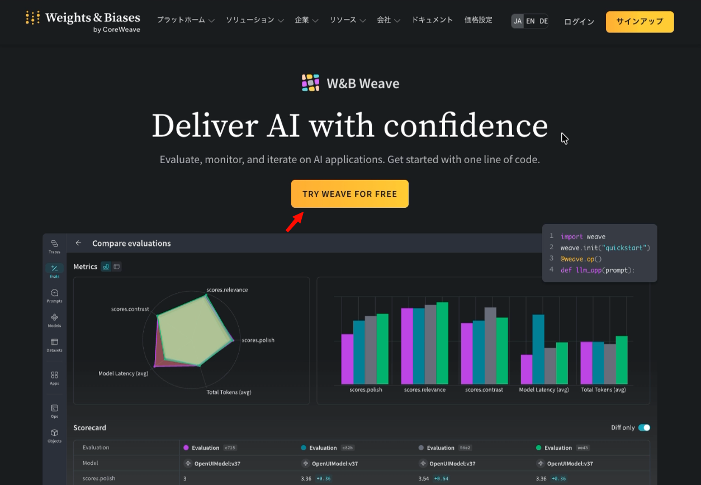

2. Google アカウントなどで連携するか、メールアドレスと任意のパスワードを入力して「SIGN UP」を選びます。メールアドレスの場合、パスワードは画面に表示される複雑さを満たす必要があります。

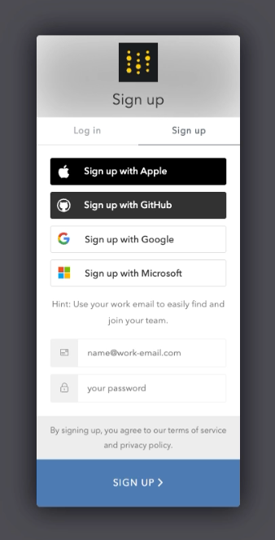

3. （メールアドレスの場合）確認メールが届くので、メール内の「Verify Email Address」をクリックします。Weave のサイトに戻るので、メールアドレスをクリックします。

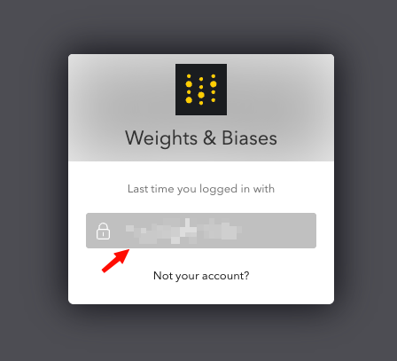

4. 名前や企業名、Usernameを求められた場合は入力し、必要なチェックをつけて「Continue」します。

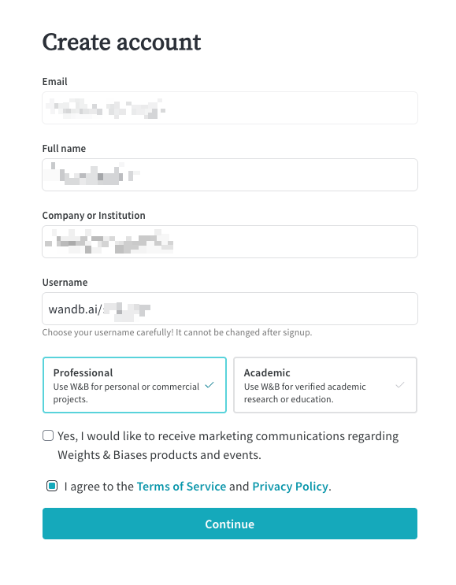

5. 組織の作成画面が表示されたら、Skip します（設定いただいても問題ありません）。

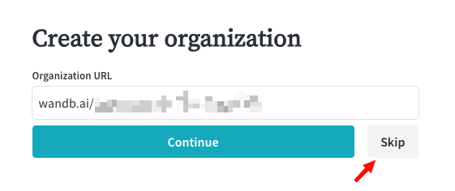

6. 「What do you want to try first?」が表示されたら「Weave」を選びます。

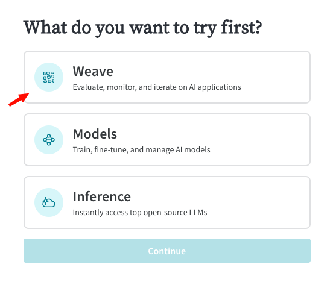

7. Quickstart の画面が表示されたら中央下にある「Generate your API key. Use it to log in to the wandb library.」の右の「Generate」を選びます。

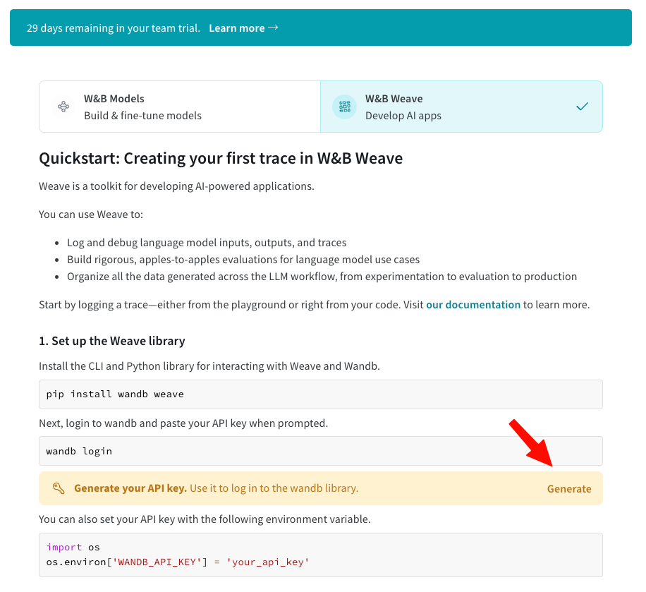

8. 画面にAPI KEYが表示されるので、「Copy」をクリックしてコピーし、講義まで保存しておいてください。「Copy and close」をクリックすれば前の画面に戻り、API-KEY の発行作業は終了です。

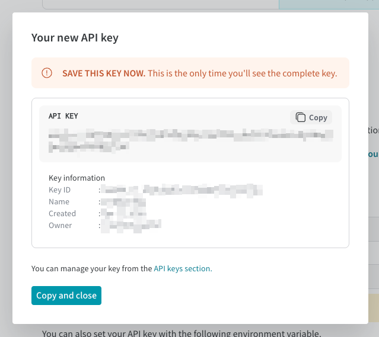

### ②Tavily

以下の手順で、Tavily のアカウント登録と API-KEY の発行ができます。

1. [https://www.tavily.com/](https://www.tavily.com/) にアクセスし、右上の「Sign Up」をクリックします。

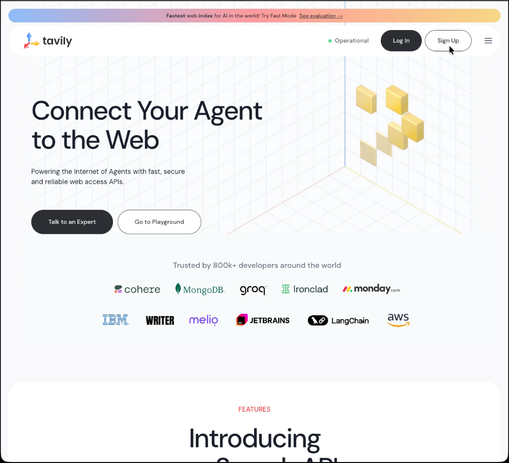

2. ログイン画面が出てくるので、入力せずに一番下の「Don't have an account?」の横にある「Sign up」をクリックします。

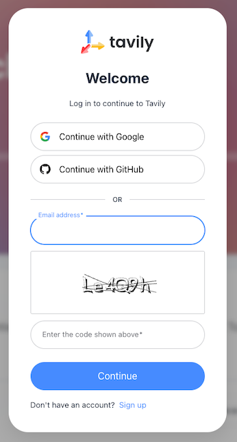

3. アカウント作成画面になるので、Google アカウントなどで連携するか、メールアドレスと画像の文字を入力して「Continue」を選びます。

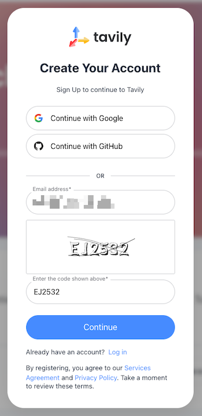

4. メールアドレスの場合は設定するパスワードを入力します。画面に表示される複雑さを満たす必要があります。その後、確認メールが届くので、メール内の「Verify Your Account」をクリックします。

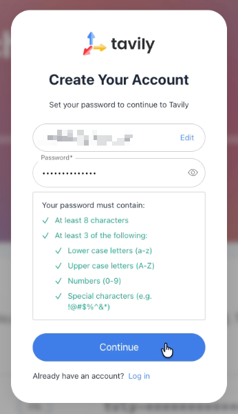

5. Tavily のサイトで最初のメッセージが表示されるので、確認して閉じます。

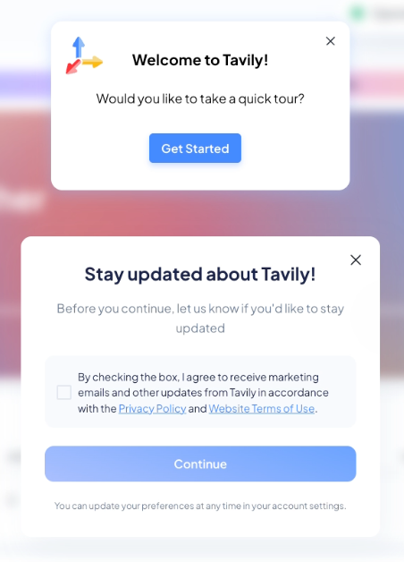

6. 自動的に API-KEY が発行されるので、コピーのアイコンをクリックしてコピーし、講義まで保存しておいてください。

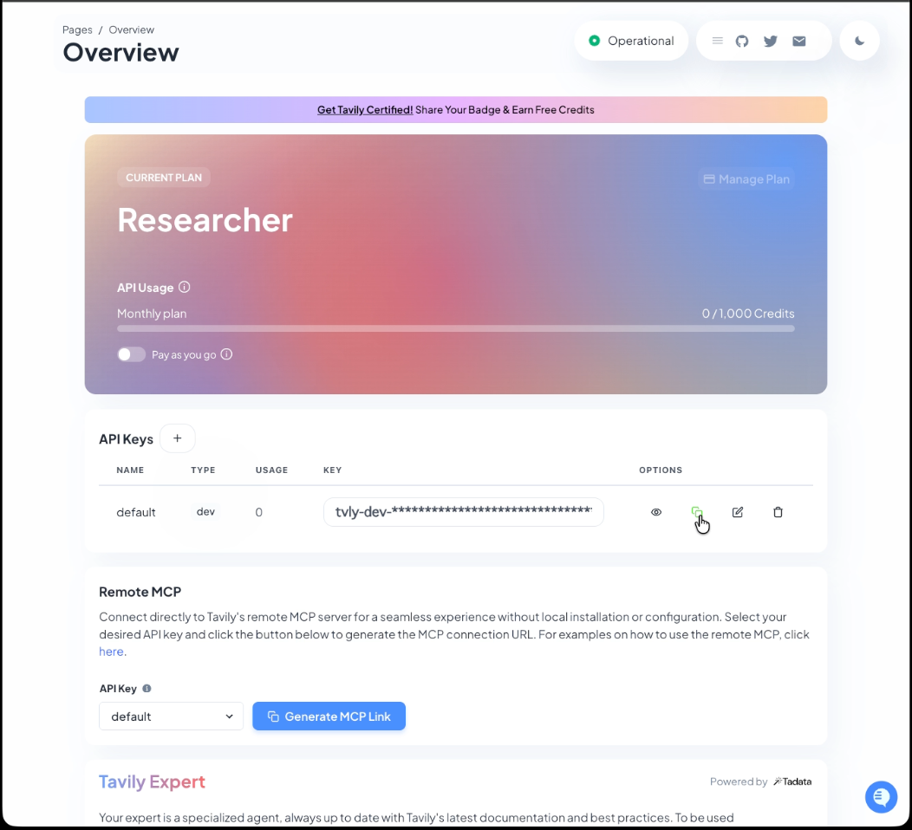

## 3. 接続確認

### ④ 弊社講座用サイト

次の URL にアクセスし、「サイトに正常に接続できました」と表示されれば正常です。

[https://academy.generative-agents.co.jp/](https://academy.generative-agents.co.jp/)

### ⑤ ハンズオン環境

講座当日に使うハンズオン環境は、以下の URL でご提供します。

https://<受講者ごとに異なるランダムな文字列>.cloudfront.net

事前の接続確認の際は、別途メールにてご案内する URL にアクセスしてください。パスワードの入力画面が表示されます。

メールでご案内したパスワードを入力してください。次の画面が表示されます。

「Yes, I trust the authors」をクリックし、次のような VS Code の初期画面が表示されれば正常です。

確認できたらブラウザを閉じてください。

**【注意】この接続確認用の環境は、複数の受講者で共用しています。そのため、この VS Code の環境で機密情報をファイルに書き込んだり、他の方の動作確認の妨げになるような操作はしないでください。**

ご不明な点がありましたら、ご案内メールの返信にてお知らせください。
