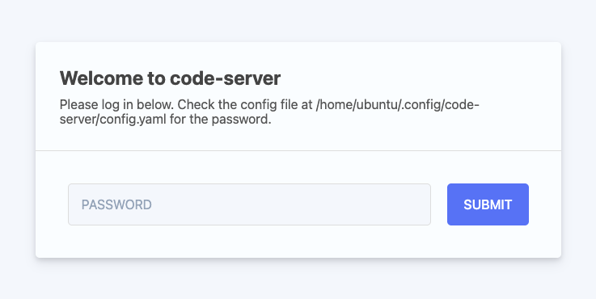
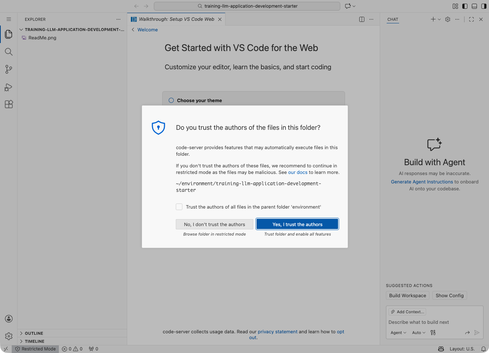
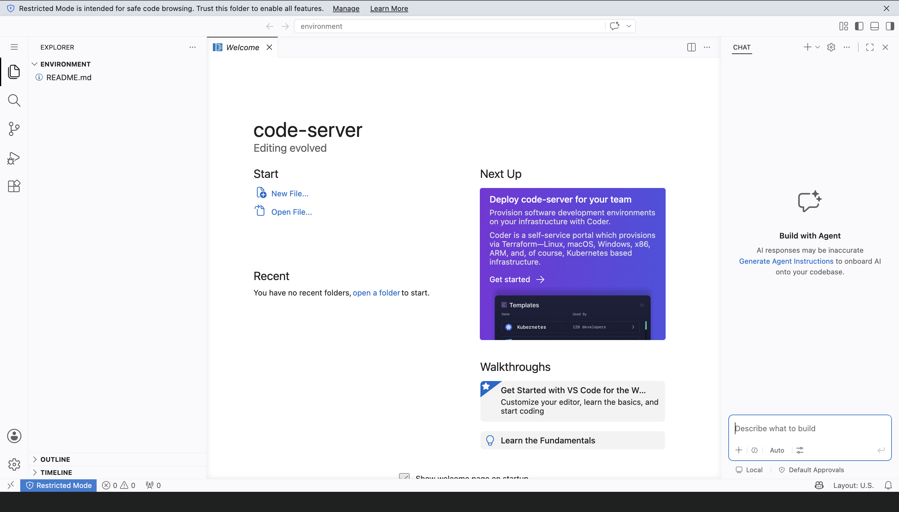

# 【AIエージェント導入リーダー養成講座】で使用するサービスの事前準備のお願い

講座内で次のサービスを使用します。これらのサービスが利用できるよう、事前に次の準備をお願いいたします。

|     | サービス名        | 講座での利用内容                                                                                                                                                                                                                                 | 実施いただく事前準備 （後述） |
| --- | ----------------- | ------------------------------------------------------------------------------------------------------------------------------------------------------------------------------------------------------------------------------------------------ | ---------------------------------- |
| ①   | GitHub            | 見本となるソースコードの共有で使います。                                                                                                                                                                                                         | 1. 社内申請 2. 接続確認       |
| ②   | 弊社講座用サイト  | 小テストやアンケートで使用します。                                                                                                                                                                                                               | 1. 社内申請 2. 接続確認       |
| ③   | ハンズオン環境    | ブラウザで利用できる VSCode の環境です。                                                                                                                                                                                                         | 1. 社内申請 2. 接続確認       |
| ④   | Zoom ミーティング | オンライン開催の場合はミーティングのツールとして使います。オフライン開催の場合でも、講師と受講者間でのファイルや URL などのやり取りのために、チャット機能のみを使います。 ※個社開催の場合は別のツールへの変更も可能ですのでご相談ください。 | 1. 社内申請                        |

## 1. 各サービスを利用するための社内申請（必要な場合）

① から ④ のサービスの利用にあたり、社内で利用申請やプロキシ設定などが必要な場合は手続きをお願いします。

### ネットワーク接続に関する補足

- ① は、[https://github.com/GenerativeAgents/training-llm-application-development/blob/main/docs/get_ready_basic.md](https://github.com/GenerativeAgents/training-llm-application-development/blob/main/docs/get_ready_basic.md) のページが閲覧できれば問題ありません。
- ②、③ は、後述の接続確認が実施できれば問題ありません。
- ④ の Zoom ミーティングは個社開催の場合に限り別のツールへの変更も可能です。変更が必要な場合はご相談ください。

## 2. 接続確認

### ② 弊社講座用サイト

次の URL にアクセスし、「サイトに正常に接続できました」と表示されれば正常です。

[https://academy.generative-agents.co.jp/](https://academy.generative-agents.co.jp/)

### ③ ハンズオン環境

講座当日に使うハンズオン環境は、以下の URL でご提供します。

https://<受講者ごとに異なるランダムな文字列>.cloudfront.net

事前の接続確認の際は、別途メールにてご案内する URL にアクセスしてください。パスワードの入力画面が表示されます。

メールでご案内したパスワードを入力してください。次の画面が表示されます。

「Yes, I trust the authors」をクリックし、次のような VS Code の初期画面が表示されれば正常です。

確認できたらブラウザを閉じてください。

**【注意】この接続確認用の環境は、複数の受講者で共用しています。そのため、この VS Code の環境で機密情報をファイルに書き込んだり、他の方の動作確認の妨げになるような操作はしないでください。**

ご不明な点がありましたら、ご案内メールの返信にてお知らせください。
