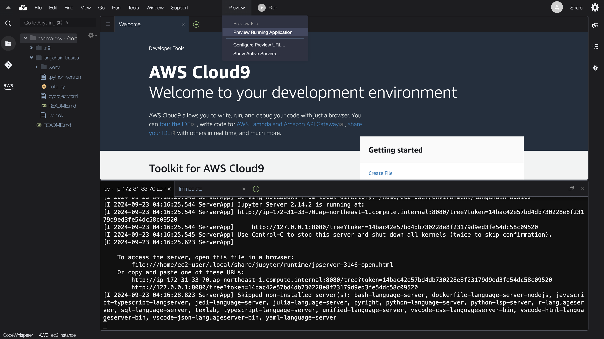
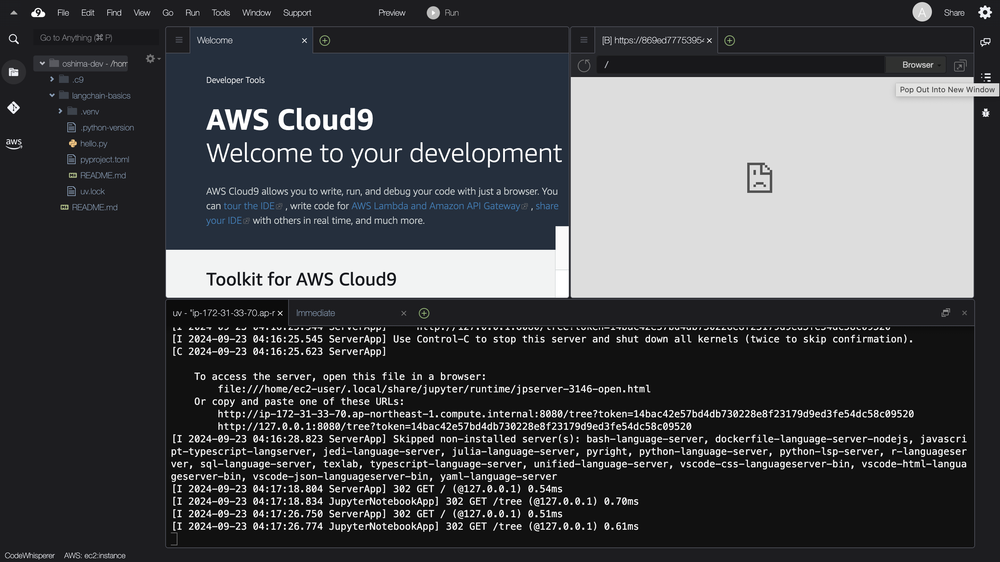
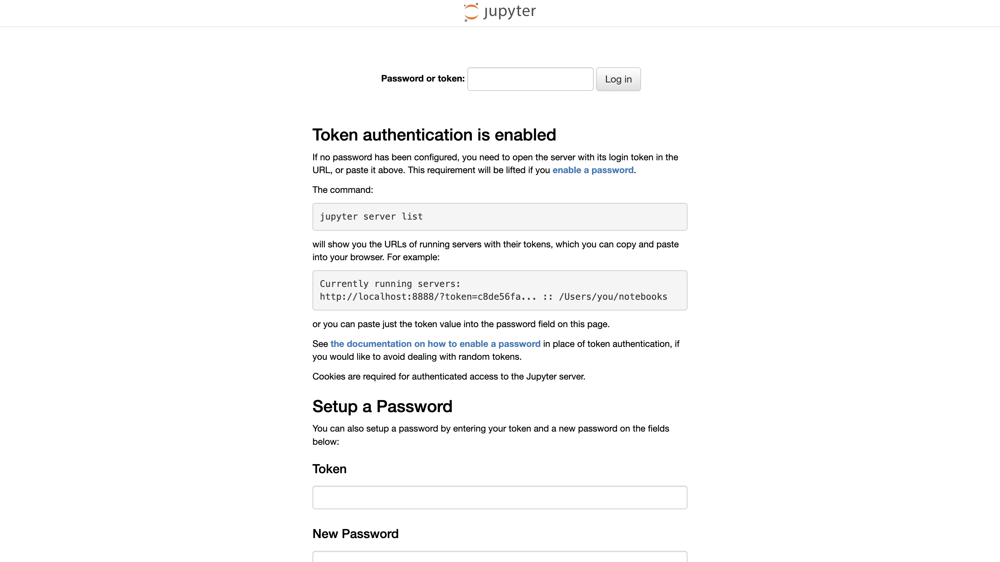
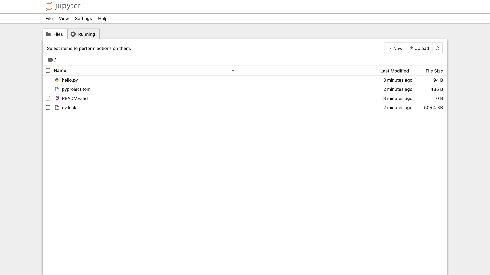
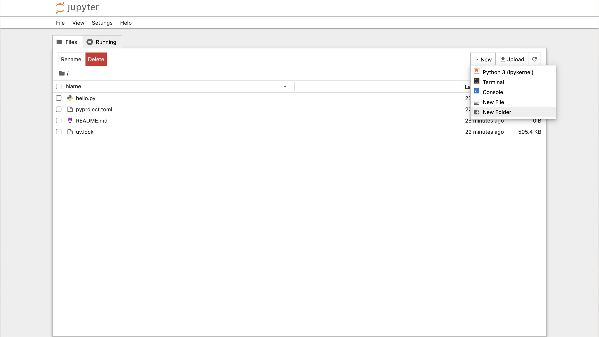
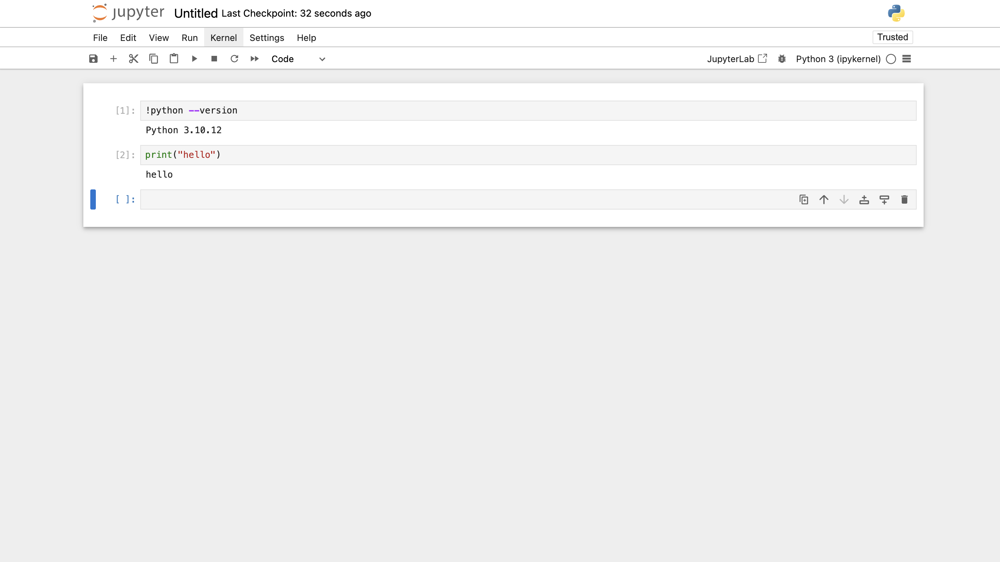

# ハンズオン環境構築手順

ハンズオン環境の構築手順です。

WSL 2 (Ubuntu) または AWS Cloud9 (Amazon Linux 2023) を想定しています。

## Python プロジェクトの初期設定

### uv のインストール

Python の特定バージョンのインストールやパッケージの管理のため、[uv](https://github.com/astral-sh/uv) をインストールします。
以下のコマンドを実行してください。

```console
curl -LsSf https://astral.sh/uv/0.4.14/install.sh | sh
```

上記のスクリプトによる `~/.bashrc` の変更を反映するため、以下のコマンドでシェルを起動しなおしてください。

```console
exec "$SHELL"
```

以下のコマンドで uv のバージョンが表示されれば、インストール完了です。

```console
uv --version
```

### Python 3.10.12 のインストール

uv で Python の特定バージョンをインストールします。
以下のコマンドを実行してください。

```console
uv python install 3.10.12
```

以下のコマンドで Python のバージョンが表示されれば、インストール完了です。

```console
uv run python --version
```

### 作業ディレクトリ作成

以下のコマンドで、作業用のディレクトリを作成してください。

```console
mkdir training-llm-app
```

以下のコマンドで、作業用のディレクトリに移動してください。

```console
cd training-llm-app
```

> [!NOTE]
> 以後のコマンドはすべて training-llm-app ディレクトリで実行します。

### プロジェクト初期化

uv を使う Python プロジェクトを初期化します。
以下のコマンドを実行してください。

```console
uv init
```

`hello.py` というファイルが生成されるので、実行してみます。
以下のコマンドを実行してください。

```console
uv run python hello.py
```

## 講座で使用するファイル等の準備

### .env ファイルの記述

training-llm-app ディレクトリに .env という名前のファイルを作成してください。

[.env.template](../.env.template) の内容をコピーして .env ファイルに貼り付けてください。

OPENAI_API_KEY の値を記入してください。

> [!NOTE]
> LANGCHAIN_API_KEY、COHERE_API_KEY、TAVILY_API_KEY はあとで記入するので、この時点では空のままで大丈夫です。

### .gitignore ファイルの作成

.env ファイルを誤って GitHub に公開したりすることがないよう、.gitignore ファイルを作成します。
以下のコマンドを実行してください。

```console
echo '.env' >> .gitignore && echo 'tmp/' >> .gitignore
```

### langchain リポジトリの clone

講座の一部で langchain リポジトリのデータを読み込んで使います。

以下のコマンドを実行して、langchain リポジトリを clone してください。

```console
git clone --depth 1 https://github.com/langchain-ai/langchain.git ./tmp/langchain
```

### 使用するパッケージのインストール

このリポジトリの [pyproject.toml](../pyproject.toml) をコピーして、`uv init` で生成された pyprojec.toml ファイルを上書きしてください。

以下のコマンドを実行して、講座内で使用するパッケージをインストールしてください。

```console
uv sync
```

## Jupyter の準備

### Jupyter の起動

以下のコマンドで Jupyter を起動することができます。

```console
uv run jupyter notebook --port 8080
```

<details>

<summary>AWS Cloud9 の場合</summary>

AWS Cloud9 の場合は、上記のコマンドの代わりに以下のコマンドを実行してください。

```console
uv run jupyter notebook --ip 0.0.0.0 --port 8080 --no-browser
```

Cloud9 上部の「Preview」>「Preview Running Application」をクリックしてください。



Cloud9 の画面内のプレビューではうまく表示されないのは想定通りです。



プレビューの右上のアイコン (Pop Out Into New Window) をクリックすると、ブラウザの別のタブでアクセスできます。

</details>

### Jupyter の動作確認



Jupyter のトークンを入力するよう求められた場合、ターミナル上に表示されているトークンをコピーしてログインしてください。



Jupyter の画面右上あたりの「New」>「New Folder」で「notebooks」というフォルダを作成します。



notebooks フォルダに移動して、Notebook を作成し、以下の 2 つが想定通り動作するか確認確認してください。

```
!python --version
```

```python
print("hello")
```



これでハンズオン環境の準備は完了です。
